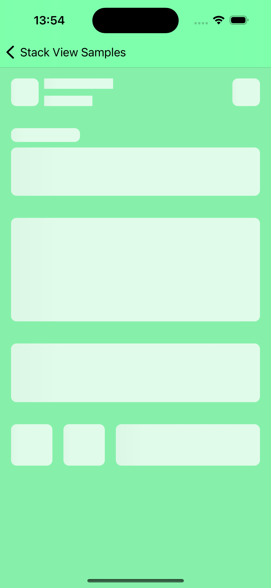
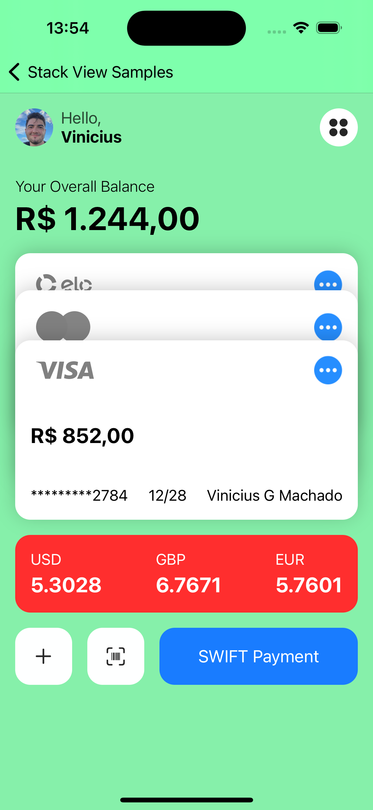
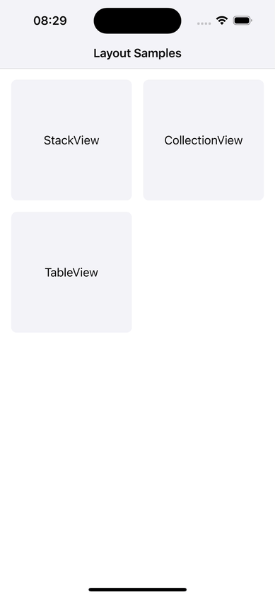

# LayoutExamples

O objetivo deste projeto é criar um guia abrangente para auxiliar tanto novos desenvolvedores quanto veteranos no desenvolvimento de aplicativos iOS. Este repositório cobrirá desde as melhores práticas de organização de projetos, passando por arquiteturas de software, padrões de design (design patterns), até exemplos de layout. A ideia é proporcionar um recurso completo e acessível para facilitar o trabalho dos desenvolvedores em todas as fases do ciclo de vida do desenvolvimento de um aplicativo iOS.

### Sumário

- [Componentes do Projeto](#componentes-do-projeto)
  - [Estrutura de Pastas](#estrutura-de-pastas)
  - [Arquitetura de Software](#arquitetura-de-software)
  - [Design Patterns](#design-patterns)
  - [Exemplos de Layout](#exemplos-de-layout)
- [Todos os Exemplos](#todos-os-exemplos)
  - [StackView](#stackview)
    - [Wallet](#wallet)
  - [CollectionView](#collectionview)
  - [TableView](#tableview)

## Componentes do Projeto

### Estrutura de Pastas:

Foi definido a organização das pastas do projeto de uma forma que facilte a manutenção e a sua escalabilidade.

```
📦 Root
├── 📂 LayoutExamples
|       ├─ 📂 Features                # Módulos. Um para cada página, com a lógica de negócio.
|       |        |
│       |        └── 📂 ExampleFeature
|       |               ├── 📜 Controller       # Executa apenas coisas relacionadas à UI - Mostrar/obter informações.
│       |               ├── 📜 ViewModel        # Recebe informações do Controller, trata todas essas informações e as envia de volta ao Controller.
│       |               ├── 📜 View             # Responsável por conter toda a implementação da UI.
│       |               ├── 📜 Coordinator      # Lógicas de navegação.
│       |               ├── 📜 Factory          # Cria Controller com suas dependencias.
│       |               └── 📜 Model            # Modelos de uso exclusivo desse módulo.
|       |
|       ├─ 📂 Shared                  # Tudo que for compartilhável entre módulos.
|       |       |
|       |       ├── 📂 Utils                    # Funções e lógicas de utilização geral e genérica.
|       |       ├── 📂 PropertyWrappers         # Wrappers.
|       |       ├── 📂 Models                   # Modelos globais de uso geral do projeto.
|       |       ├── 📂 Services                 # Lógica dos serviços.
|       |       ├── 📂 Tokens                   # Protocolos genericos com para implementações de UIColor, UIFont, UIImage.
|       |       ├── 📂 UI                       # Componentes globais de utilização geral no projeto.
|       |       ├── 📂 Coordinator              # Configuração do Coordinator do projeto.
|       |       └── 📂 Extensions               # Extensões de classes para facilitar o desenvolvimento.
|       |
|       └─ 📂 SupportingFiles         # Arquivos de suporte do projeto, AppDelegate, Assets e etc.
└── 📂 LayoutExamplesTests      # Testes unitarios.
```

### Arquitetura de Software

Neste projeto, construiremos uma aplicação usando o padrão de arquitetura `MVVM`. Na maior parte de nosso aplicativo, temos um controlador de visualização (UI) que precisa buscar dados (API), e exibi-los na UI.

### Design Patterns

- Singleton
- Observer: Implementação usando Notification Center e KVO (Key-Value Observing).
- Factory: Criando objetos de maneira flexível e escalável.
- Strategy: Alterar o comportamento de um objeto em tempo de execução.

### Exemplos de Layout

Utilizaremos o `AutoLayout` em `ViewCode`.

- [x] StackView
- [ ] TableView
- [ ] CollectionView

---

# Todos os exemplos

## StackView

Desenvolvimento de layouts utilizando `StackViews` para a organização do conteúdo.

### Wallet

[Referência do layout no Dribble 🏀](https://dribbble.com/shots/24079428-Online-Wallet-Mobile-iOS-App)
Design da Interface by Valeria Afanaseva

<table>
  <tr>
      <th>Carregando</th>
      <th>Sucesso</th>
      <th>GIF</th>
    </tr>
  <tr>
      <td></td>
      <td></td>
      <td></td>
  </tr>
</table>

## CollectionView

👷🏻‍♂️ Em construção...

## TableView

👷🏻‍♂️ Em construção...
